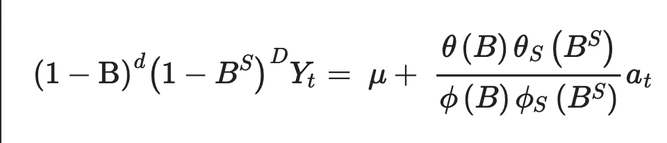

## Introduction
Malaria affects over 200 million people every year, all over the world. Although there are cases on virtually every continent, 92% of the disease burden lies in sub-saharan Africa. Last year alone over 405,000 people died from malaria. 

To eliminate the disease fully, practices need to be in place that can address the issue before it has spread to new regions and to efficiently distribute limited resources to the areas in need. That is why I propose a machine learning model that predicts the disease dynamics and potential new hotspots for the disease so that timely aid may be distributed and stop the spread of the disease. 

A challenge that comes with the disease is the number of asymptomatic individuals who spread the disease to uninfected areas. In highly affected regions, like Nigeria, almost everyone has parasites, but without symptoms. As transportation systems improve and human interconnectedness increases, understanding human mobility becomes essential for disease prevention. Malaria is also difficult to track because of the seasonality of the disease. To fully understand the spread of the disease it is essential to understand both mosquito and human population dynamics.

A common model to predict malaria incidence is the ARIMA model because it is able to account for the transmissibility and seasonality of malaria and it has more predictive power than other machine learning models. The main limitation of the ARIMA structure is that it relies on the assumption that there is a linear correlation in the data. The newer LSTM model has had success predicting events over long time periods and with lags in time series because of its ability to maintain contextual information. The performance of the ARIMA can be improved using an LSTM when they are combined using a stacked architecture structure. 

## Inquiry
My research asks what is the best way to predict malaria disease dynamics using machine learning? The machine learning models that are used to predict how the disease will spread are a vital part of the research, but before that comes finding the best data sources. Looking at the different data sources is explanatory because it is looking at the factors which contribute to the disease. A big part of determining the data is figuring out which data types contribute the most to the spread of the disease. The first sub-question of my research asks, what is the best combination of covariates that most closely relate to the spread of the disease? Machine learning models are only as good as the data they are given, and they improve over time with more accurate data. Through the different research papers, each author uses a different combination of covariates from weather, rainfall, humidity, temperature, elevation, topographic wetness, vegetation, land cover, distance to water, infrastructure, travel, socioeconomic, population, CDR, and human movement data to train and test their models. That is why it is important to determine which subset of covariates will lead to the most accurate model, without overfitting. 

The second part of my research looks at the actual data science models and attempts to compare the pros and cons of each of the machine learning models to determine which model is best suited for predicting future disease dynamics. This part of the research is evaluative because it is looking at the effectiveness of the LSTM, ARIMA, and potentially the LSTM + ARIMA Stacked model. When trying to determine the best way to predict malaria disease dynamics, the second sub-question is asked. What is the best machine learning model to predict future cases and hotspots for malaria? 

Finally, the third sub-question is an attempt to eliminate a gap within the research. Oftentimes authors either focused on finding the right data types, or finding the right model, but never considered both. Different combinations of data will lead to varying performance outcomes with different models. That is why I try to look at the question of how do we find the best combinations of covariate data and which model would be best to pair it with? 

## Data 
The study done by the KCDC used data from 576 days between January 1st of 2016 to July 29th of 2017. For the infectious disease data they used information about malaria, scarlet fever, and chickenpox because the data was being reported frequently which was necessary for predicting future cases. Query data was also acquired from Twitter using a web crawler. 

Table 1 describes the different data types used including the type, source, and description. The different types of data that were used were disease data (occurrences), weather data (temperature, humidity), and query data (Twitter). 

Table two shows the statistics for the data used in the study. The table shows that on average, over 23 people were infected with malaria daily, with a standard deviation of 13.89 persons. 

Although the ARIMA and LSTM papers do not use CDR data, a big part of my project is pairing these models with more accurate human movement data, so it is important to talk about how the CDR data was acquired by other authors. Currently, CDR data can be difficult to get access to because attaining the data requires some sort of personal relationship with a specific operator. 

CDR data is logged whenever someone with a mobile phone makes or receives a call or text, and a digital data point is created based on the location of the nearest cell tower. In cities where cell towers are abundant, the locations are within a block of where the call/text was made, but in more rural areas, where cell towers are more sparse, the resolution drops off. 

To understand individual human movements, and more broadly population-level dynamics, phone users can be followed over time using the CDR data they generate to create longitudinal travel patterns. 

The diagram above describes how CDRs are used to approximate location and movement for individual users. Each circle represents a phone tower and the arrows represent the movements, both observed and unobserved. On the graph, the y-axis represents the time the call was made, and the x-axis shows what day in a seven day period the call was made on. The color blocks indicate which cell tower logged the call/text. With this information, a user's movement can be tracked overtime as information is logged simultaneously for time, day, and location. 

## Methods 
The two methods that would be well suited for predicting future movement of malaria are the ARIMA and LSTM machine learning models. 

The ARIMA model is an Auto Regressive Integrated Moving average Model which is used to forecast future time points. 
AutoRegression calculates the weights for a variable based on past values of itself. The ARIMA model looks at trends between previous time points of itself and predicts future time points from the previous trends [9]. The ARIMA is the most commonly used model because it accounts for the seasonality and transmissibility better than most models. Although, ARIMA models are limited by the assumption that there is a linear correlation structure [7].he ARIMA model is especially good for analyzing non-stationary time series data. Since the model is robust over fluctuating data, it is especially useful for modeling a disease such as malaria, that is seasonal. The ARIMA model “treats a data sequence for a given variable over time as a random sequence and uses a mathematical model to fit the data.”

The seasonal ARIMA model is represented by ARIMA(p, d, q)(P, D, Q)S. P is represents the autoregressive part, D represents the order of differencing, Q represents the order of the moving average process, and S is the seasonal cycle. The equation below represents the written form of the ARIMA model. 

The LSTM model is a Long Short Term Memory network which is a more advanced version of a Recurrent Neural Network. LSTMs yield more accurate results because more contextual information is available when making predictions. The four parts of the LSTM are the “ input gate, output gate, and forget gate that are non-linear summation units that control the activation of the cell.” The input gate takes in the information for the current cell. The forget gate multiplies the previous cell yielding a value from zero to one. This value indicates whether the given information should be “forgotten” or passed on as context for the next predictions. With this action, the LSTM is capable of keeping information for longer periods of time than an RNN. The output gate then takes this updated information and outputs it to the next cell. The activation function of the gate is a sigmoid function. 

Below are the equations the LSTM uses to forget, store, renew, and output information from a cell. 

To compare the models the Root Mean Squared Error (RMSE) was used to evaluate the prediction rates of the different models. The RMSE takes the measurement for the different between the predicted and actual values. 

To combine machine learning models, either stacking, boosting, or bagging. Compared to boosting and bagging, stacking has the highest prediction precision and the lowest risk of overfitting. Shown in the diagram below, stacking trains the models (ARIMA and LSTM in this case) individually, and then combines them by creating a second learning algorithm that is trained based on the prediction results of the primary models. 

