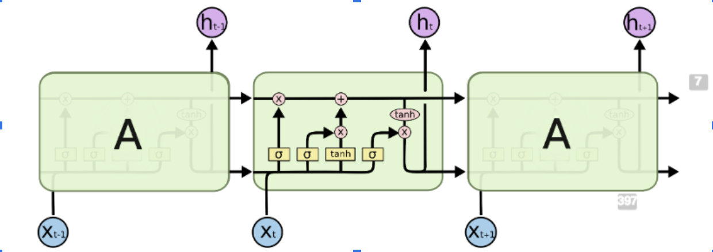

# Annotated Bibliography 

## Problem Statement 

## Source 1: Connecting Mobility to Infectious Diseases: The Promise and Limits of Mobile Phone Data

###  Wesolowski Amy, Buckee Caroline O., Engø-Monsen Kenth, Metcalf C. J. E. Connecting Mobility to Infectious Diseases: The Promise and Limits of Mobile Phone Data. Journal of Infectious Diseases. 2016;214(suppl 4):S414–S420. doi: 10.1093/infdis/jiw273.

Disease is spread when human migration and movement introduces new pathogens to susceptible populations. As movement increases, more contact is made with susceptible and infected persons. Before CDR and mobile phone data, tracking human movement in real time was a difficult feat. Prediction models and maps were based off of simplistic assumptions about human movement and interactions because there was no other way to efficiently monitor them. CDR (Call Detail Record) data ameliorates this problem by making data on human movement much more available, especially in third-world countries where disease epidemic is high. Currently, 39% of the population in Sub-Saharan Africa owns a mobile phone, and this number is increasing rapidly. The way that CDR data is created by listing the closes cell tower the phone interaction was made from which gives a location estimate for the individual, as well as the code for the SIM card of the user. One difficulty that CDR data poses is the lack of openly available data because companies do not want to give up their information easily because they have to take into account privacy concerns. To remedy this issue, much of the CDR data being used is anonymous so that the information cannot be tracked back to specific individuals. Another difficulty is with biases in terms of who owns phones, the calling behavior of individuals, tower density within a specific area, and how many SIM cards individuals own. Although the data is not perfect, currently, it is the best way to model human movement both quickly and accurately. 

The models that use CDR data simulate patterns of disease spread through space and time with individual human movements and knowledge of the biological disease. Some difficulties that the models propose are a lack of validation, parameter sensitivity, and error propagation. The authors concluded that the best way to address these issues would be through aggregation of the models. 

The authors studied multiple disease dynamics, one of these diseases being malaria. For malaria, disease data was derived from parasite prevalence maps that were used in conjunction with information on travel between settlements to understand the flow of malaria parasites. Some of the goals based on the malaria studies were to identify the locations at risk of outbreak and the locations where the disease originated. This research has been expanded to malaria, dengue, ebola, HIV, and cholera. 

This paper shows that mobile phone data has the power to quantify human movements and relate these population dynamics to the spread of infectious diseases in third-world countries where disease epidemics are high, and available data is low. 

## Source 2: Predicting Infectious Disease Using Deep Learning and Big Data

### Chae, Sangwon & Kwon, Sungjun & Lee, Donghyun. (2018). Predicting Infectious Disease Using Deep Learning and Big Data. International Journal of Environmental Research and Public Health. 15. 1596. 10.3390/ijerph15081596. 

This article compares different Machine Learning and statistical prediction models against one another in predicting disease dynamics. The study was conducted in South Korea by the KCDC. The article proposed two novel ideas that I would like to utilize in my solution model: using mobile phone data and machine learning models to predict disease spread one week in advance. The authors compare the commonly used ARIMA (Autoregressive Integrated Moving Average) model and OLS (Ordinary Least Squares) model to ten different LSTM (Long-Short Term Memory) models and ten different DNN (Deep Neural Network) models. 

A data-based infection disease prediction model is beneficial because it can handle situations in real time, where as the current statistical based methods have delays in reporting. In previous studies, twitter data has been used to monitor occurences of mental illness, and in this study it is being used to model infectious disease. Along with mobile phone data, the authors used weather, rainfall, humidity data, temperature, and query data. The authors used Keras —  a high-level open source neural network API for python —  to build the machine learning models. 

Deep learning neural networks are a more advanced version of neural networks because they contain many hidden layers, whereas neural networks only contain one, along with the input and output layer. LSTMs are a more advanced subset of RNNs (Recurrent Neural Networks). Recurrent Neural Networks are generally used for sequential data. The most common uses for RNNs are making predictions within text, but in this case, the RNN is being used to make predictions over space and time. One pitfall of RNNs is their inability to maintain information/context over time, and that’s why LSTMs are being used instead. LSTMs contain a forget gate layer which either outputs a 0 or 1 after each iteration which is used to represent which information should be kept for context in the future and which information should be forgotten. LSTMs prevent gradient loss over time which is useful for this situation where context and information must be maintained over longer periods of time. 

When creating the different models, only two parameters —  the optimizer and the dropout —  of the DNN were changed. The optimizer is used to change the attributes, such as the weights or the learning rate, of the neural network in order to minimize losses. The dropout is a machine learning technique in which some data is ignored during training to increase the robustness of a model and prevent overfitting.

The conclusions showed that the DNN performed the most stably with a 24% performance improvement over the ARIMA model. The LSTM also did much better than the traditional ARIMA model with a 19% performance improvement. The DNN models performed best on average, but the LSTMs proved to be more accurate when infectious diseases were spreading. 

This paper offers solutions to which machine learning models would be best to approach infectious disease dynamics. This used mobile phone data from social media, but CDR data has the potential to improve the models’ predicting abilities. 

## Source 3: Assessing the interplay between human mobility and mosquito borne diseases in urban environments

### Massaro, E., Kondor, D. & Ratti, C. Assessing the interplay between human mobility and mosquito borne diseases in urban environments. Sci Rep 9, 16911 (2019). https://doi.org/10.1038/s41598-019-53127-z

This article studies the interplay between human mobility and dengue outbreaks in Singapore. Human mobility leads to humans moving to non-infected areas and giving non-infected mosquitoes the virus. This is how a vector-borne virus such as dengue or malaria is spread. More than 50 million people are infected with dengue per year, and over half the world’s population is at risk of infection. Every year dengue leads to half a million hospitalizations and over 25,000 deaths. The authors suggest that an agent-based transmission model is used to predict disease outbreaks. In this model, humans and mosquitoes are represented as agents that go through the epidemic states of dengue. This article is slightly different than others because it is tackling infectious disease spread in urban environments as opposed to third world countries. Rapid urbanization in certain areas has led to increase outbreaks in big cities. The two major outbreaks studied were in Singapore in 2013 and 2014. Poor housing conditions and widespread poverty exacerbate the impact of infectious diseases in city environments. 

The authors focus on comparing random mobility models that lead to perfect mixing in the population with more structured mobility models. This allows them to evaluate the importance of intra-city human mobility in dengue spread. Dengue dynamics are modeled by using a stochastic population model based on the ordinary differential equation model. The city is viewed by overlaying a 320x320m cell grid over the city. Each model is composed of two phases: the reaction and diffusion phases. The reaction phase is where disease transmission takes place in each cell and the diffusion phase is where agents are moved from one grid cell to another. Each phase consists of two parts: the reaction phase is split into day and night and the diffusion phase is split into people’s morning and evening commute. 

The authors tested four different models: mobile phone data-based model, random work locations, Levy-distribution model, and radiation model. The mobile phone data model estimated the home and work locations of the individuals using CDR data. The random model estimated home cells by mobile phone data but work locations were assigned randomly. The levy-distribution assigns each agent a random home location based on the mobile phone data and work cell is chosen based on a distance that is determined by the Levy-distribution model. The radiation model uses census data to distribute the home locations of agents and choose work locations based on the radiation model from Simini et al. 

After testing, the mobile phone and radiation model worked much better than the random and levy-distribution models when predicting human movement. The two main parameters were the number of mosquitoes per human and the number of bites per mosquito. All of the models produced the main temporal trends well and for the spatial distribution analysis, the random model did not work, but the other models were able to predict key outbreak hot spots in the region. 

This study proves that disease spread can exhibit localized patterns within cities, and that the simplistic representation of human movement within cities is outdated. This study proves the correlation between mobile phone data and human movement within a small area. This work can be applied to third world countries where human movement is on a larger scale. 

## Source 4

## Source 5
